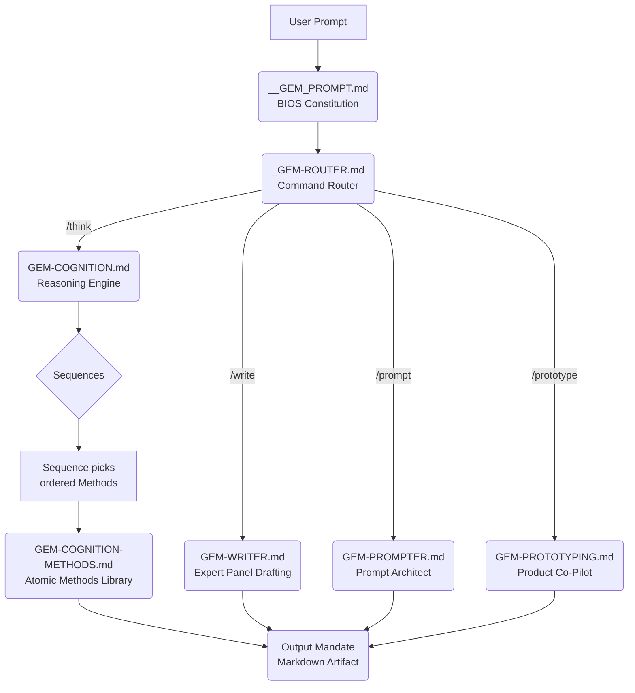

# "Live" Google Doc GEM instructions: The Unified Skill Platform

*One installation. Infinite expert workflows.* GEM turns Google Gemini into a single, orchestrated system that can analyze, write, prototype, and engineer prompts without ever leaving the thread. The entire stack lives in markdown "skill files" so you can ship updates at the speed of thought (turns out Google had skills before Claude, this whole time!).

*Try the GEM out here for yourself:* https://gemini.google.com/gem/1XkWAKL7KNcnyrmXk8M9UGg99e08V8m9p?usp=sharing

---

## Why Builders will Love this live-GEM approach

- **Zero Context Switching:** Install one "BIOS" prompt and stay in the same conversation while you write, red-team, prototype, and ship.
- **Composable Expertise:** Chain expert frameworks together - think `/think` -> `/write` -> `/prototype` - with no handoffs or prompt gymnastics.
- **Live-Tuned Behavior:** Simply update a Google Doc and see the model change on the next GEM invocation. No fiddling in the tiny GEM prompt text box.
- **Business-Ready:** Framework isolation plus explicit formatting rules guarantee predictable, copy/paste-friendly output every time.

---

## How the System Fits Together

- `__GEM_PROMPT.md` - The constitutional BIOS that enforces the universal rules and immediately hands control to the router --> Add this to the GEM prompt text box, and add the rest of the Google Docs as Knowledge files.
- `_GEM-ROUTER.md` - A deterministic command parser that announces the active framework and executes it top-to-bottom.
- Framework "cartridges" in `src/` (that you paste into separate Google Docs with the same name e.g. GEM-WRITER)- Modular instruction sets (Writer, Cognition, Prompter, Prototyping, etc.) that behave like code libraries.

---

## The Cognition -> Sequences -> Methods Breakthrough

`GEM-COGNITION.md` is more than a reasoning template - it is a programmable execution engine:

- **Hierarchical Selection:** Commands first look for an exact method name, then a named sequence, and only then fall back to semantic intent.
- **Sequences as Playbooks:** Sequences are declarative workflows: an ordered array of method names plus an optional synthesis directive. No accidental method mixing.
- **Methods as Deterministic Micro-Prompts:** Each method in `GEM-COGNITION-METHODS.md` stores a precise execution prompt, required headings, and formatting rules. They are atomic, versionable "functions" you can reuse across sequences.
- **Working Memory Discipline:** Outputs from each step append to working memory, feeding downstream methods without rereading source material.
- **Output Mandate:** Every method renders under `### *Step X: ...*` headings with a final `### *Synthesis*` when sequences run, ensuring artifacts drop cleanly into docs or wikis.

This architecture gives you an extendable reasoning OS: add a method, declare a sequence, and Cognition now runs a brand-new analysis pipeline - no additional code required.

---

## Flagship Frameworks

- `GEM-WRITER.md` - Five-expert drafting panel with explicit depth flags (`--simple`, `--summary`, `--complete`, `--expanded`, `--scientific`) and strict Google Doc formatting.
- `GEM-STYLE-GUIDE.md` - Voice, tone, and anti-slop rules plus a global mandate: every output must survive copy/paste into email or Docs with zero citations.
- `GEM-COGNITION.md` and `GEM-COGNITION-METHODS.md` - Structured reasoning brain plus the method library that powers it.
- `GEM-PROMPTER.md` - Elite prompt engineer with a pre-filled intake protocol, optimized prompt output, and technique notes.
- `GEM-PROTOTYPING.md` - Gated product workshop that convenes an internal strategist, designer, and engineer before emitting a high-fidelity prototype spec.

---

## Install GEM in Five Minutes

1. **Create the BIOS** - In Gemini, open a new custom instruction set and paste the entire contents of `__GEM_PROMPT.md`.
2. **Spin Up Skill Docs** - For every other file inside `src/`, create a Google Doc with the same name, but without the `.md` (for example `_GEM-ROUTER`, `GEM-WRITER`).
3. **Copy the Frameworks** - Paste the full markdown of each file into its matching Google Doc. Preserve headings, horizontal rules, and callouts - they are executable instructions.
4. **Attach the Library** - In Gemini, attach all of those Docs to your BIOS prompt as knowledge files.
5. **Smoke Test** - In a fresh chat, attach a doc, then run `/write`, `/think get_root_causes`, `/prompt`, and `/prototype` to verify the router announces each framework and the outputs respect their mandates.

---

## Everyday Command Palette

- `/write ...` or `/rewrite ...` - Activates `GEM-WRITER` for drafting in the house voice. Combine with depth flags to control scope.
- `/think [method_or_sequence]` - Engages `GEM-COGNITION`; exact method names trigger deterministic runs, while open requests leverage semantic matching.
- `/prompt ...` - Launches `GEM-PROMPTER`'s co-design intake to yield an optimized, production-ready prompt plus technique notes.
- `/prototype ...` - Starts the prototyping workshop to validate assumptions, co-create flows, and output a detailed spec.
- No slash? You still get a helpful response, but the BIOS and Router rules stay in force.

---

## Sample Flywheel: Idea -> Insight -> Artifact

1. `/think first_principles_deconstruct` - Cognition decomposes the problem under numbered steps.
2. `/think first_principles_reconstruct` - Cognition Identifies the root cause, builds a first principle approach, ideates creatively, and summarizes the resulting ideas into a coherent approach
3. `/thinkg refine_prd` - Turns this creative idea into a structured PRD, with suggestions on how to iteratively improve it.
4. `/prototype Build the walkthrough` - Prototyping converts the approved strategy into a full product spec with screens, flows, and interactions. Paste directly into Figma Make, Loveable, etc.
5. `/prompt Draft the launch prompt for Design QA` - Prompter produces a reusable instruction set for downstream teams.

One conversation, five expert outputs, zero copy/paste drama.

---

## Repository Guide

- `src/` - Executable framework files. Treat them like source code: small, composable, and versioned.

---

## Build Your Own Cartridges

- Clone an existing framework pattern: define a trigger, spell out the execution workflow, lock the formatting mandate.
- Extend `GEM-COGNITION-METHODS.md` whenever you discover a repeatable thinking move. It slots straight into sequences.
- Keep instructions clean, markdown-native, and clearly segmented with horizontal rules so Gemini parses them flawlessly.

Ready to extend GEM? Fork it, craft a new cartridge, and share what you build - the platform is designed to grow with your team's imagination.